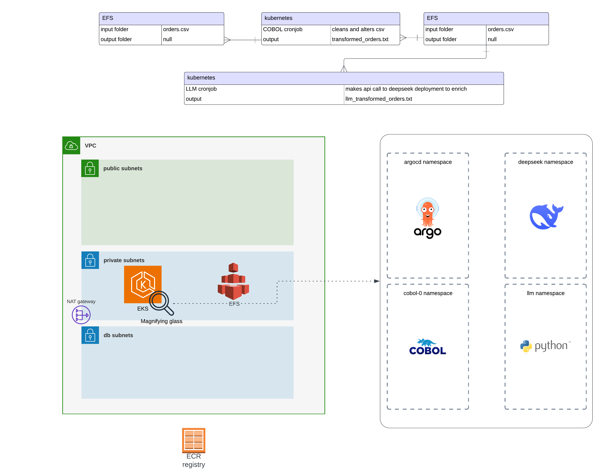
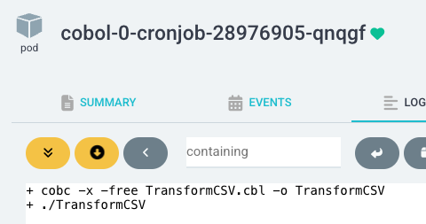
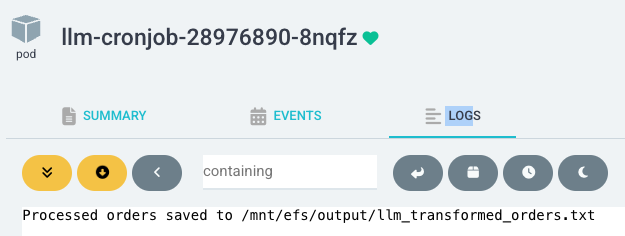
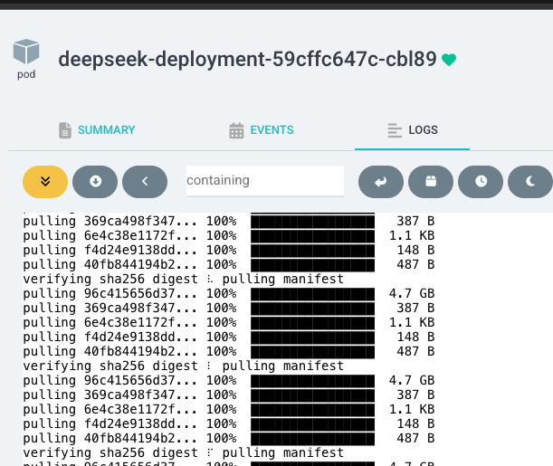

# EKS Data Processing Pipeline
### Legacy and cutting edge together

This project sets up an **EKS cluster with EFS**, using Terraform for infrastructure provisioning. The cluster runs several workloads, including:
- **COBOL-based data transformation**: A Kubernetes CronJob processes CSV files.
- **LLM data enrichment**: An LLM enriches the transformed data.
- **Kubernetes DevOps utilities**: Includes ArgoCD, ExternalDNS, and AWS Load Balancer Controller.



## Table of Contents
- [Architecture Overview](#architecture-overview)
- [Infrastructure](#infrastructure)
  - [EKS & EFS](#eks--efs)
  - [Terraform](#terraform)
- [Kubernetes Deployments](#kubernetes-deployments)
  - [DevOps Components](#devops-components)
  - [Microservices](#microservices)
  - [COBOL Processing](#cobol-processing)
  - [LLM Enrichment](#llm-enrichment)
- [Usage](#usage)
  - [Deploying Infrastructure](#deploying-infrastructure)
  - [Deploying Kubernetes Components](#deploying-kubernetes-components)
  - [Running the Pipeline](#running-the-pipeline)

## Architecture Overview
The project consists of:
1. **An AWS EKS Cluster** deployed with Terraform.
2. **EFS Storage** mounted to the cluster for persistent storage.
3. **A Kubernetes CronJob** that:
   - Runs a COBOL script to transform CSV data.
   - Calls an LLM to enrich the transformed data.

## Infrastructure

### EKS & EFS
- **EKS**: Kubernetes cluster deployed via Terraform.
- **EFS**: Persistent storage for processed CSV files.

### Terraform
Terraform manages:
- VPC (`vpc.tf`)
- EKS Cluster (`eks.tf`)
- EFS Storage (`efs.tf`)
- ECR for container images (`ecr.tf`)
- Kubernetes resources (`k8s.tf`)

## Kubernetes Deployments

### DevOps Components
Located in `k8s/devops`, this includes:
- **ArgoCD** for GitOps-based deployments.
- **ExternalDNS** for automatic DNS record management.
- **AWS Load Balancer Controller** for handling ingress.

### Microservices
Defined in `k8s/microservices`, this includes:
- **COBOL Data Processing (`cobol_0.yaml`)**
- **DeepSeek LLM (`deepseek.yaml`)**
- **LLM-based Order Processing (`llm.yaml`)**

### COBOL Processing
A Kubernetes CronJob in `docker/cobol_0`:
- Runs `TransformCSV.cbl` (COBOL) inside a container.
- Alters a CSV file stored on EFS.

### LLM Enrichment
- The processed CSV is sent to an LLM (`process_orders.py`).
- Runs inside a container in Kubernetes (`docker/llm`).

## Usage

### Deploying Infrastructure
1. Initialize Terraform:
   ```bash
   terraform init
   ```
2. Plan deployment:
   ```bash
   terraform plan -out=plan.out
   ```
3. Apply the changes:
   ```bash
   terraform apply plan.out
   ```

### Deploying Kubernetes Components
1. Configure `kubectl` to use the EKS cluster:
   ```bash
   aws eks update-kubeconfig --name <cluster-name> --region <aws-region>
   ```
2. Deploy Helm charts:
   ```bash
   helm template . |k apply -f -
   ```

### Running the Pipeline
- The COBOL CronJob runs automatically at scheduled intervals.
- Processed CSV data is enriched using the LLM service.
- Logs and output can be monitored with:
  - CLI
      ```bash
     kubectl logs -f <pod-name>
     ```
    - ArgoCD
    
    
    
    
  
    
