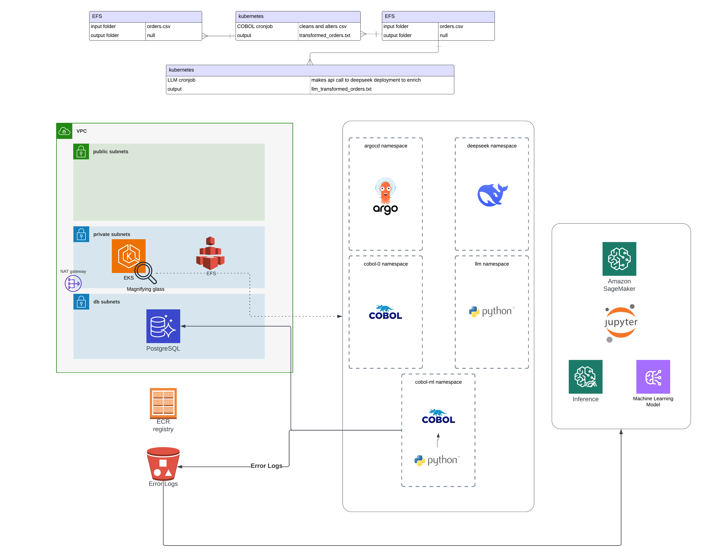
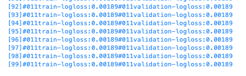

# EKS Data Processing Pipeline
### Legacy and cutting edge together

This project provisions a **secure, automated data processing pipeline** on AWS using **EKS** and **EFS**. It merges **COBOL-based legacy processing** with **modern AI/ML capabilities**, showcasing a hybrid architecture capable of transforming, validating, enriching, and analyzing data.



## Table of Contents
- [Architecture Overview](#architecture-overview)
- [Infrastructure](#infrastructure)
  - [Terraform Modules](#terraform-modules)
  - [EKS & EFS Setup](#eks--efs-setup)
- [Kubernetes Deployments](#kubernetes-deployments)
  - [DevOps Components](#devops-components)
  - [Microservices](#microservices)
- [Pipeline Workflow](#pipeline-workflow)
  - [COBOL CSV Transformation](#cobol-csv-transformation)
  - [LLM Enrichment](#llm-enrichment)
  - [PostgreSQL Integration](#postgresql-integration)
  - [Error Classification](#error-classification)
  - [ML Model & Evaluation](#ml-model--evaluation)
- [Usage](#usage)
  - [Deploying Infrastructure](#deploying-infrastructure)
  - [Deploying Kubernetes Components](#deploying-kubernetes-components)
  - [Running the Pipeline](#running-the-pipeline)
  - [Monitoring & Observability](#monitoring--observability)

---

## Architecture Overview

This pipeline:
1. Deploys a **Kubernetes cluster on AWS using Terraform**.
2. Mounts **EFS for shared, persistent storage**.
3. Runs a series of **microservices and CronJobs**:
   - Legacy COBOL jobs for ingesting and validating financial CSV data.
   - AI/ML components for enrichment, classification, and prediction.
   - PostgreSQL storage for verified data.
   - Error analysis and daily ML model evaluation.

---

## Infrastructure

### Terraform Modules
All infrastructure is provisioned using Terraform:

- **VPC**: `vpc.tf`
- **EKS Cluster**: `eks.tf`
- **EFS Filesystem**: `efs.tf`
- **ECR for Docker images**: `ecr.tf`
- **SageMaker**: `sagemaker.tf`
- **Aurora PostgreSQL**: `aurora.tf`
- **Kubernetes Resources**: `k8s.tf`
- **State Management**: `backend.tf`


### EKS & EFS Setup
- **EKS** hosts all Kubernetes workloads.
- **EFS** provides persistent storage mounted across pods for sharing CSVs, and COBOL-generated output.
- **S3** provides persistent storage mounts for logs, Sagemaker models, and training data.

---

## Kubernetes Deployments

### DevOps Components (`k8s/devops`)
Managed with **ArgoCD** and Helm, includes:
- **ArgoCD** (GitOps deployment engine)
- **ExternalDNS** (auto-manage Route 53 records)
- **AWS Load Balancer Controller**
- **NVIDIA GPU Device Plugin** (for LLM jobs)
- **Secrets Store CSI Driver** (for secrets)
- **Custom StorageClass** (for EFS)
- **S3 CSI Driver** (for error logs and Sagemaker access)

### Microservices (`k8s/microservices`)
Services deployed:
- `cobol-0.yaml`: Original COBOL transformation job that uses LLM to enhance outputs from COBOL applications
- `cobol-ml-raw-generator.yaml`: Generates raw financial CSVs
- `cobol-ml-ingestion.yaml`: Validates and ingests raw files and transforms them
- `cobol-ml-postgresql.yaml`: Inserts to PostgreSQL and outputs any error logs to S3 mount
- `cobol-ml-logs-preprocess.yaml`: Error log preprocessor runs daily to allow ML pipeline
- `llm.yaml`: LLM enrichment service
- `deepseek.yaml`: LLM local model
- `ubuntu-worker.yaml`: Utility pod for manual inspections


---

## Pipeline Workflow

### COBOL CSV Transformation
- Located in `docker/cobol_0`:
- A Kubernetes CronJob in docker/cobol_0:
  - Runs TransformCSV.cbl (COBOL) inside a container.
  - Alters a CSV file stored on EFS.
- LLM Enrichment
  - The processed CSV is sent to an LLM (process_orders.py).
  - Runs inside a container in Kubernetes (docker/llm).

### COBOL CSV Ingestion & PostgreSQL Validation
In `docker/cobol_ml_cobol_ingestion` and `cobol_ml_cobol_postgresql`:
- **`IngestCSV.cbl`** validates and prepares records.
- Valid entries are inserted into PostgreSQL.
- Errors are logged in structured JSON format:

  Example:
  ```json
  {
    "timestamp": "2025-03-30T23:06:42.127715654Z",
    "file": "ingested-2025-03-30-22-25-02.tsv",
    "row": "2022-10-24,Bank Transaction,ATM Withdrawal,-0.0",
    "reason": "Invalid Amount: -0.0",
    "classification": "validation_error"
  }
  ```

### LLM Enrichment
Located in `docker/llm` and `docker/deepseek`:
- Enriches validated records with inferred metadata or classifications.
- Output data is saved for further ML analysis.


### ML Model & Evaluation (SageMaker)
- An ML model is trained using valid vs. error records.
- SageMaker is used to:
  - Train a classifier.
  - Evaluate daily model accuracy.
  - Output confusion matrices.

  

  

---

## Usage

### Deploying Infrastructure
1. Initialize Terraform:
   ```bash
   terraform init
   ```
2. Plan deployment:
   ```bash
   terraform plan -out=plan.out
   ```
3. Apply infrastructure:
   ```bash
   terraform apply plan.out
   ```

> One-time setup. All infrastructure (EKS, EFS, ECR, Aurora, SageMaker) will be created.

### Deploying Kubernetes Components
1. Point `kubectl` to EKS:
   ```bash
   aws eks update-kubeconfig --name <cluster-name> --region <region>
   ```
2. Deploy using Helm:
   ```bash
   helm template . | kubectl apply -f -
   ```

> ArgoCD will handle GitOps deployment afterward.

### Running the Pipeline
- **COBOL CronJob** auto-triggers transformation jobs.
- **LLM & PostgreSQL Pods** listen and act on generated data.
- Logs and metrics can be tracked via:

  - CLI:
    ```bash
    kubectl logs -f <pod-name>
    ```

  - ArgoCD Dashboard:

    
  
    

### Monitoring & Observability
- ArgoCD dashboards visualize deployment flows.
- EFS logs and PostgreSQL entries give traceability.
- JSON error logs processed daily.
- SageMaker metrics stored and evaluated periodically.

---

## Key Features Proven Out 
- [x] COBOL applications run on Kubernetes using CronJobs.
- [x] EFS file persistence across pods.
- [x] PostgreSQL integration via containerized COBOL.
- [x] Structured logging of errors for ML training.
- [x] Daily ML model evaluation with SageMaker.
- [x] GitOps-based deploys with ArgoCD.

---
